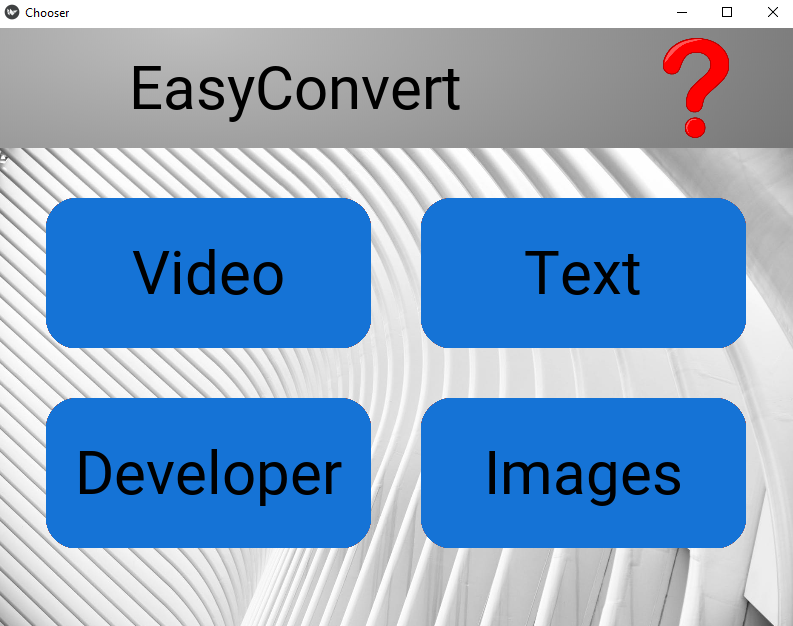

# Easy-Convert-Application

This repository contains the work of an android application, Easy Convert. My app's purpose is to provide a more convenient alternative to standard cloud version file converting and web-based conversions. My app is an easy to use, unique, and local means of converting datatypes. The app was built with kivy and python. 

# Screenshot Of The App

# How To Use The App

To use the app simply select one of the buttons based on what file you currently have and what filetype you want it to become. Upon selection you will be prompted to your file dialog box on your respective device. Choose your current file and within seconds you will be prompted with a notification that your newly converted file is ready. The conversions are simultaneous as well as efficient. 

# Demo
A demo of the full app can be seen on my YouTube channel: https://www.youtube.com/watch?v=XZYGNK6uewo

